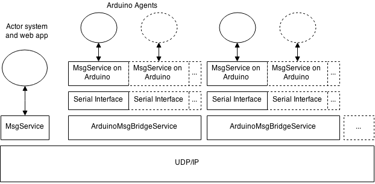
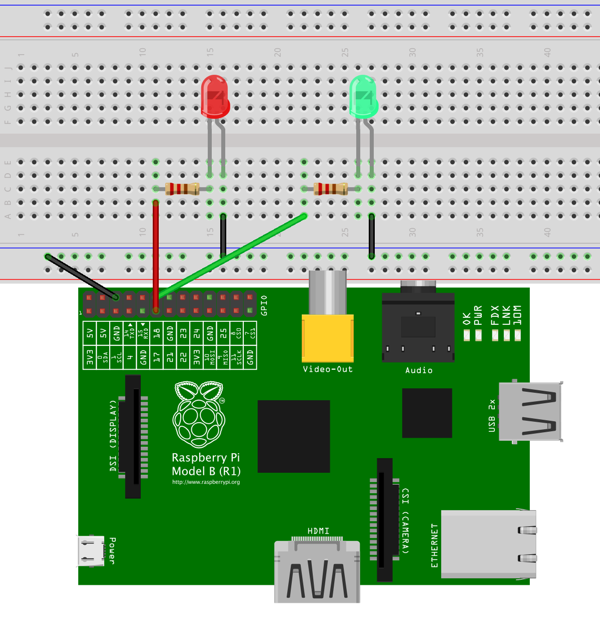

# play-parking-pi
A parking lot management system, implemented with Arduino and Raspberry pi.

Companion project of [arduino-parking](https://github.com/AL333Z/arduino-parking) and [arduino-udp-msgservice](https://github.com/AL333Z/arduino-udp-msgservice).

#What is this
A dead simple app made with play framework, that can run on a raspberry pi.

#System architecture

The overall architecture of the system is divided in the following main parts:
- the web app and the actor system, running on the raspberry pi and connected to 2 leds via GPIO;
- the MsgService, that intercepts the messeges from UDP/IP and redirect these messages to the actor system;
- the [arduino-udp-msgservice](https://github.com/AL333Z/arduino-udp-msgservice), that bridge messages from arduinos (coming from one o multiple serial ports) to UDP/IP;
- the [arduino-parking](https://github.com/AL333Z/arduino-parking) agent, that is placed in each parking space and send messages to the system via its serial port, using a MsgService.

The code contained in this repository refers only on the first and second points.

#Hardware
The raspberry pi has one green led connected on GPIO1 and one red lead on GPIO0.

#Up and running

- connect one or more arduino with [arduino-parking skecth](https://github.com/AL333Z/arduino-parking) via usb to a pc, a raspberry or both

- launch [a message bridge](https://github.com/AL333Z/arduino-udp-msgservice/tree/master) for each pc/raspberry connected to arduinos.

- clone or download the project
- `cd <your folder>`
- change `Global.scala`, to configure the number of parking slot (default is 2)
- `play dist` or `sbt dist`
- unzip and move the folder to raspberry pi
- cd `your folder on raspberry`
- `chmod +x bin/play-parking-pi`
- `sudo ./bin/play-parking-pi -J-Xms64M -J-Xmx128M`
