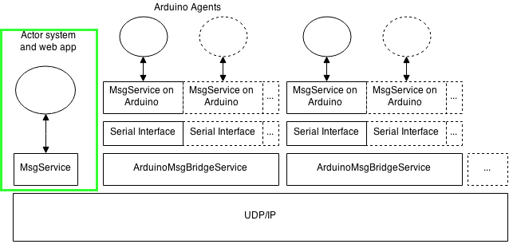

# play-parking-pi
A parking lot management system, implemented with Arduino and Raspberry pi.

Companion project of [arduino-parking](https://github.com/AL333Z/arduino-parking) and [arduino-udp-msgservice](https://github.com/AL333Z/arduino-udp-msgservice).

#What is this
A dead simple app made with play framework, that can run on a raspberry pi.

#System architecture

The overall architecture of the system is divided in the following main parts:
- the web app and the actor system, running on the raspberry pi and connected to 2 leds via GPIO;
- the MsgService, that intercepts the messeges from UDP/IP and redirect these messages to the actor system;
- the [arduino-udp-msgservice](https://github.com/AL333Z/arduino-udp-msgservice), that bridge messages from arduinos (coming from one o multiple serial ports) to UDP/IP;
- the [arduino-parking](https://github.com/AL333Z/arduino-parking) agent, that is placed in each parking space and send messages to the system via its serial port, using a MsgService.

The code contained in this repository refers only on the first and second points.

#Actor system and web app
It's just a play framework app, with some additional actors.

`UPDMulticastWrapperActor` is a wrapper on the UPD/IP message service. It maps the messages and forwards `CarArrived` and `CarGone` to the main actor of the system, `ParkingActor`.

`ParkingActor` is initialized with a fixed number of parking spaces, and keeps memory of system state (thanks to the messages depicted above). When the car park is full, it turns on the red led, otherwise only the green led is turned on.

`LedActor` only receives two kind of messages (`SwitchOn` and`SwitchOff`) and it interacts with its GPIO pin.

The interacton with users from HTTP is handled by a single controller (`Application.scala`), that interact with the underlying actor system (akka) using the ask pattern (`?` operator), with the `GetParkingStatus` message, receiving the number of free parking spaces as a response.

#Hardware
The raspberry pi has one green led connected on GPIO1 and one red lead on GPIO0.

#Up and running

- connect one or more arduino with [arduino-parking skecth](https://github.com/AL333Z/arduino-parking) via usb to a pc, a raspberry or both

- launch [a message bridge](https://github.com/AL333Z/arduino-udp-msgservice/tree/master) for each pc/raspberry connected to arduinos.

- clone or download the project
- `cd <your folder>`
- change `Global.scala`, to configure the number of parking slot (default is 2)
- `play dist` or `sbt dist` or `activator dist`
- unzip and move the folder to raspberry pi
- cd `your folder on raspberry/play-parking-pi`
- `chmod +x bin/play-parking-pi`
- `sudo ./bin/play-parking-pi -J-Xms64M -J-Xmx128M`
- open your browser to `<your-raspberry-ip>:9000`
- enjoy :)

